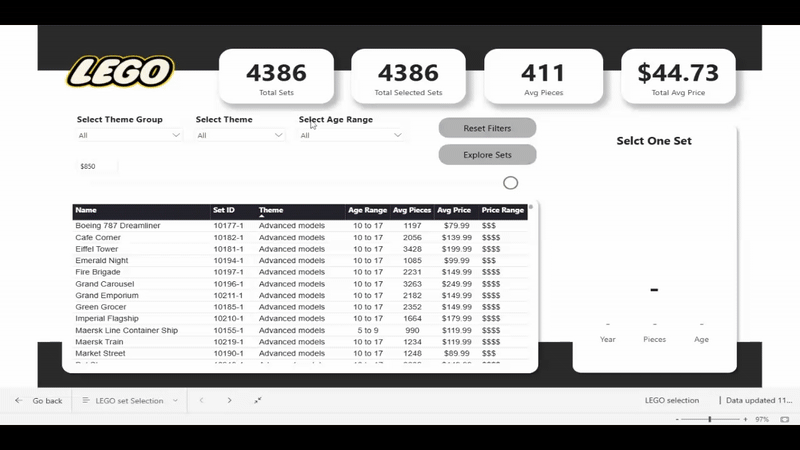
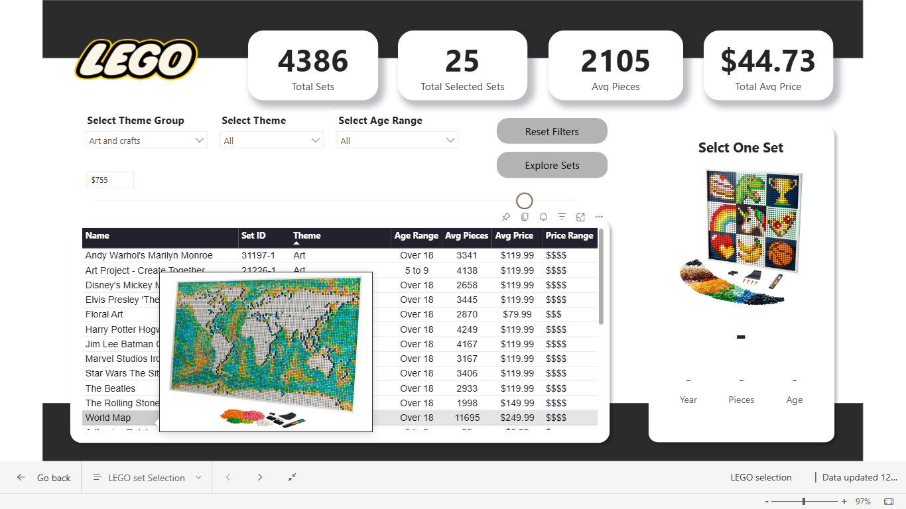
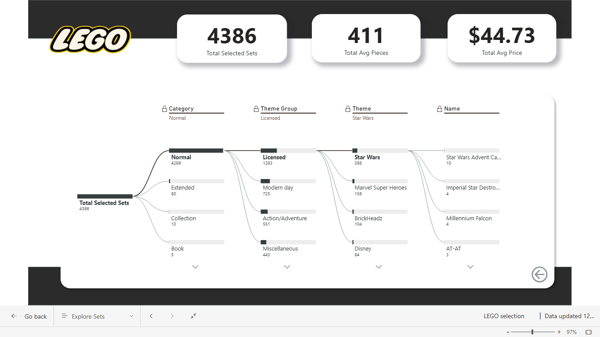

# LEGO Set Explorer Dashboard

**Need a LEGO set but can't seem to decide?** 

I got you covered with an interactive Power BI dashboard designed to help you explore and analyze a comprehensive dataset of _**4,386** LEGO sets released from 1970 to 2022_. This project demonstrates advanced data visualization techniques and interactive dashboard design to uncover insights about product evolution, pricing strategies, and market segmentation within the LEGO product portfolio.

## 📊 Project Overview

The LEGO Set Explorer Dashboard transforms a complex dataset of thousands of sets into an intuitive, interactive exploration tool. Users can filter and analyze sets by theme, age range, price point, and complexity, with visual feedback and detailed set information displayed in real-time.


**Dataset Size:** 4,386 LEGO sets  
**Time Period:** 1970–2022  
**Key Metrics:** Average Pieces (411), Average Price ($44.73), Price Range Analysis

## 🎯 Features

### Interactive Filtering
- **Theme Group Selection:** Filter sets by overarching theme categories (Normal, Licensed)
- **Theme Filtering:** Drill down into specific themes (Star Wars, Harry Potter, Disney, etc.)
- **Age Range Selection:** Target sets by age appropriateness
- **Dynamic Reset Functionality:** One-click filter reset to explore new combinations

### Key Performance Indicators
- Total Sets in Portfolio
- Total Selected Sets (filtered results)
- Average Pieces per Set
- Average Price per Set

### Visual Analytics
- **Set Details Table:** Comprehensive view with columns for Set ID, Theme, Age Range, Average Pieces, Average Price, and Price Range categorization
- **Hover-Over Image Previews:** Instant visual reference of selected sets
- **Price Range Indicators:** Visual categorization from budget-friendly ($) to premium collector sets ($$$$$)
- **Decomposition Tree Analysis:** Hierarchical breakdown of set distribution across categories, theme groups, and themes
- **Set Selection Card:** Detailed information panel for individual set exploration, including Year, Pieces, and Age

### Dashboard Pages
1. **LEGO Selection:** Main exploration interface with interactive filters, metrics, and comprehensive set table
2. **Explore Sets:** Decomposition tree visualization for hierarchical analysis and drill-down exploration

## 📈 Key Insights

- **Product Complexity:** Average LEGO sets contain 411 pieces, demonstrating the evolution toward sophisticated building experiences
- **Pricing Strategy:** LEGO has developed five distinct price tiers, ranging from budget sets to premium collector editions
- **Market Segmentation:** Advanced age targeting strategies segment products from early childhood (2-5) through adult collectors (16+)
- **Theme Evolution:** The product catalog has expanded from simple categories to licensed franchises, reflecting LEGO's strategic partnerships and market expansion
- **Portfolio Diversity:** 4,386 unique sets provide extensive consumer choice across multiple themes, age groups, and price points

## 🛠️ Technical Implementation

### Data Preparation
- Conditional columns created for age range categorization and price tier classification
- Data validation and normalization of set attributes, pricing, and theme information

### DAX Measures
- **Total Sets:** Counts all LEGO sets in the dataset
- **Avg Pieces:** Calculates average piece count across selected sets
- **Avg Price:** Computes average retail price for filtered selections
- **Dynamic Filtering:** Measures respond to all active filter selections for accurate calculations

### Power BI Features Used
- **Numeric Range Parameters:** Custom increment controls for precise filtering
- **Custom Image Tooltips:** Set images displayed on hover for enhanced user experience
- **Bookmark Navigation:** Multi-page dashboard with seamless transitions and filter management
- **Decomposition Tree Visuals:** Hierarchical data exploration enabling drill-down analysis
- **Responsive Design:** Dashboard layout optimizes for different screen sizes and resolutions
- **Cross-Visual Filtering:** Selections in one visual automatically filter related visualizations

### Data Model
- Star schema with set dimensions and fact tables
- Relationships established between set attributes, themes, categories, and pricing
- Optimized column structure for efficient filtering and aggregation

## 📁 Repository Structure

```
lego-set-explorer/
├── README.md
└── files/
    └── lego_selection.pbix
```

**lego_selection.pbix:** The complete Power BI dashboard file containing all data connections, transformations, visualizations, and interactivity


### How to Use the Dashboard
1. **Filter by Theme Group:** Use the dropdown to select Normal or Licensed theme categories
2. **Refine by Specific Theme:** Choose individual themes (Star Wars, Disney, etc.) within the selected group
3. **Target Age Ranges:** Filter sets appropriate for specific age demographics
4. **Reset Filters:** Click "Reset Filters" to clear all selections and start fresh
5. **Explore Individual Sets:** Click on a set in the table to view detailed information including images, year, piece count, and age range
6. **Analyze Hierarchies:** Navigate to the "Explore Sets" page to view decomposition tree analysis for deeper insights

## 📊 Dashboard Screenshots

**Main Exploration Interface:**


The main dashboard provides an at-a-glance view of key metrics, comprehensive filtering options, and detailed set information with hover-over image previews.

**Hierarchical Analysis View:**


The exploration page features a decomposition tree visualization, enabling users to drill down through categories, theme groups, and individual themes while tracking set distribution.

## 💡 Key Learning Outcomes

This project developed proficiency in:
- Advanced Power BI visualization and interactivity
- DAX formula creation for dynamic calculations
- User-centered dashboard design and navigation
- Data storytelling through visual hierarchy and filtering
- Implementation of bookmark actions for multi-page navigation
- Integration of images and custom tooltips for enhanced user experience
- Product analysis and market segmentation insights

## 📚 Resources

**Project Source:** Maven Analytics Guided Project  
**Dataset:** LEGO Sets (1970–2022)  
**Tools:** Microsoft Power BI Desktop

## 🔗 Links

- [Maven Analytics](https://mavenanalytics.io/)
- [Power BI Documentation](https://learn.microsoft.com/en-us/power-bi/)
- [LinkedIn Profile](https://www.linkedin.com/in/abhinav-d-b713b2214/))

## 📝 Notes

This dashboard serves as both a practical data exploration tool and a demonstration of professional-grade Power BI development. The combination of aesthetic design, functional interactivity, and analytical depth showcases the capability to translate complex datasets into actionable insights.

## 📧 Contact & Support

For questions, feedback, or collaboration opportunities, feel free to connect on LinkedIn or open an issue in this repository.

---

**Last Updated:** December 2025  
**Dashboard Status:** Complete and Production-Ready
